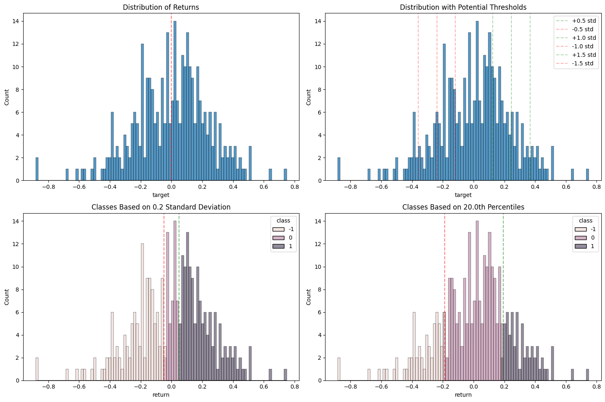

- [Features](#features)
  - [Features analysis](#features-analysis)
    - [Target to classes](#target-to-classes)
  - [Features importance](#features-importance)
  - [Features selection](#features-selection)
- [Prediction](#prediction)
  - [evaluation](#evaluation)
    - [calculated returns based on various probability prediction thresholda](#calculated-returns-based-on-various-probability-prediction-thresholda)
    - [cumulative returns bases od prob predictions](#cumulative-returns-bases-od-prob-predictions)
  - [charts](#charts)


# Features

## Features analysis

```python
# Calculate different percentiles
percentiles = [1, 5, 10, 20, 30, 40, 50, 60, 70, 80, 90, 95, 99]
print("\nPercentiles:")
for p in percentiles:
    print(f"{p}th percentile: {df['target'].quantile(p/100):.6f}")

# Plot distribution
plt.figure(figsize=(15, 10))

# Plot 1: Overall distribution
plt.subplot(2, 2, 1)
sns.histplot(df['target'], bins=100)
plt.title('Distribution of Returns')
plt.axvline(x=0, color='r', linestyle='--', alpha=0.5)

# Plot 2: Distribution with potential thresholds
plt.subplot(2, 2, 2)
sns.histplot(df['target'], bins=100)
plt.title('Distribution with Potential Thresholds')

# Add lines for different standard deviations
std = df['target'].std()
mean = df['target'].mean()
for i in [0.5, 1.0, 1.5]:
    plt.axvline(x=mean + i*std, color='g', linestyle='--', alpha=0.3, label=f'+{i} std')
    plt.axvline(x=mean - i*std, color='r', linestyle='--', alpha=0.3, label=f'-{i} std')
plt.legend()

# Let's try different threshold approaches
# Approach 1: Standard deviation based
std_multiplier = 0.2
std_threshold = std_multiplier * std
labels_std = np.where(df['target'] > std_threshold, 1,
                     np.where(df['target'] < -std_threshold, -1, 0))

# Approach 2: Percentile based
percentile_threshold = 0.2  # top/bottom 20%
top_threshold = df['target'].quantile(1 - percentile_threshold)
bottom_threshold = df['target'].quantile(percentile_threshold)
labels_percentile = np.where(df['target'] > top_threshold, 1,
                           np.where(df['target'] < bottom_threshold, -1, 0))

# Plot 3: Distribution of STD-based classes
plt.subplot(2, 2, 3)
sns.histplot(data=pd.DataFrame({'return': df['target'], 'class': labels_std}), 
            x='return', hue='class', bins=100)
plt.title(f'Classes Based on {std_multiplier} Standard Deviation')
plt.axvline(x=std_threshold, color='g', linestyle='--', alpha=0.5)
plt.axvline(x=-std_threshold, color='r', linestyle='--', alpha=0.5)

# Plot 4: Distribution of Percentile-based classes
plt.subplot(2, 2, 4)
sns.histplot(data=pd.DataFrame({'return': df['target'], 'class': labels_percentile}), 
            x='return', hue='class', bins=100)
plt.title(f'Classes Based on {percentile_threshold*100}th Percentiles')
plt.axvline(x=top_threshold, color='g', linestyle='--', alpha=0.5)
plt.axvline(x=bottom_threshold, color='r', linestyle='--', alpha=0.5)

plt.tight_layout()
plt.show()

# Print class distributions
print("\nClass Distribution (STD-based):")
print(pd.Series(labels_std).value_counts(normalize=True))

print("\nClass Distribution (Percentile-based):")
print(pd.Series(labels_percentile).value_counts(normalize=True))

# Calculate mean return for each class
print("\nMean Return by Class (STD-based):")
std_df = pd.DataFrame({'return': df['target'], 'class': labels_std})
print(std_df.groupby('class')['return'].mean())

print("\nMean Return by Class (Percentile-based):")
perc_df = pd.DataFrame({'return': df['target'], 'class': labels_percentile})
print(perc_df.groupby('class')['return'].mean())
```


### Target to classes

Based on std dev

```python
# Read and prepare the data
df = pd.read_csv('model_data.csv')
df = df.drop('ts_event', axis=1)

# Separate features and target
X = df.drop('target', axis=1)
y = df['target']

# Split the data first so we only use train data statistics for thresholds
X_train, X_test, y_train, y_test = train_test_split(X, y, test_size=0.2, random_state=42)

# Calculate threshold based on training data only
train_std = y_train.std()
threshold = 0.2 * train_std

# Transform targets into classes (update this function) instead of -1,0,1 do 0,1,2
def create_labels(y, threshold):
    return np.where(y > threshold, 2,
                   np.where(y < -threshold, 0, 1))

y_train_classes = create_labels(y_train, threshold)
y_test_classes = create_labels(y_test, threshold)

# Print class distribution
print("Training Class Distribution:")
print(pd.Series(y_train_classes).value_counts(normalize=True))
print("\nTest Class Distribution:")
print(pd.Series(y_test_classes).value_counts(normalize=True))
```

based on percentile/threshold

## Features importance

```python
#XGB top 20 feature importance
feature_importance = pd.DataFrame({
    'feature': X.columns,
    'importance': xgb_model.feature_importances_
})
feature_importance = feature_importance.sort_values('importance', ascending=False).head(20)

plt.figure(figsize=(12, 6))
sns.barplot(x='importance', y='feature', data=feature_importance)
plt.title('Top 20 Most Important Features')
plt.xlabel('Feature Importance')
plt.tight_layout()
plt.show()

```

## Features selection

# Prediction

## evaluation

```python
# Calculate directional accuracy
directional_accuracy = (np.sign(y_pred) == np.sign(y_test)).mean()
print(f"Directional Accuracy: {directional_accuracy:.4f}")

#confusion matrix
from sklearn.metrics import confusion_matrix
# Plot confusion matrix
plt.figure(figsize=(10, 8))
cm = confusion_matrix(y_test_classes, y_pred)
sns.heatmap(cm, annot=True, fmt='d', cmap='Blues')
plt.title('Confusion Matrix')
plt.ylabel('True Label')
plt.xlabel('Predicted Label')
plt.show()
```
### calculated returns based on various probability prediction thresholda

```python
# .predict_proba() gives the probabilities for each class
print("Predicted probabilities:", model.predict_proba(X_test))
# Output example:
# [
#  [0.35, 0.65],  # 35% not spam, 65% spam
#  [0.70, 0.30],  # 70% not spam, 30% spam
#  [0.45, 0.55],  # 45% not spam, 55% spam
# ]
```

Chart probabilities

```python
# Predict probabilities for each class
probabilities = model.predict_proba(X_test)  # Shape: (n_samples, n_classes)
results_df = pd.DataFrame({
    'Date': dates_test,
    'Short Probability': probabilities[:, 0],   # Probability of class 0 (short)
    'Neutral Probability': probabilities[:, 1], # Probability of class 1 (neutral)
    'Long Probability': probabilities[:, 2]     # Probability of class 2 (long)
}).sort_values(by='Date')  # Sort by date for time series plotting

fig = go.Figure()

# Add lines for each class probability
fig.add_trace(go.Scatter(
    x=results_df['Date'], y=results_df['Short Probability'],
    mode='lines', name='Short (Class 0)', line=dict(color='red')
))

fig.add_trace(go.Scatter(
    x=results_df['Date'], y=results_df['Neutral Probability'],
    mode='lines', name='Neutral (Class 1)', line=dict(color='orange')
))

fig.add_trace(go.Scatter(
    x=results_df['Date'], y=results_df['Long Probability'],
    mode='lines', name='Long (Class 2)', line=dict(color='green')
))

# Add title and labels
fig.update_layout(
    title="Time Series of Predicted Class Probabilities",
    xaxis_title="Date",
    yaxis_title="Probability",
    legend_title="Class"
)

fig.show()

```

### cumulative returns bases od prob predictions
```python
# Calculate returns based on probablity predictions
def calculate_returns(predictions, actual_returns, confidence_threshold=0.0):
    pred_probs = final_model.predict_proba(X_test_selected)
    max_probs = np.max(pred_probs, axis=1)
    
    # Only take positions when confidence exceeds threshold
    positions = np.zeros_like(predictions, dtype=float)
    confident_mask = max_probs > confidence_threshold
    
    # Convert predictions 0->-1, 2->1 for returns calculation
    adj_predictions = np.where(predictions == 2, 1, np.where(predictions == 0, -1, 0))
    positions[confident_mask] = adj_predictions[confident_mask]
    
    returns = positions * actual_returns
    return returns, np.mean(confident_mask)

# Test different confidence thresholds
confidence_thresholds = [0.4, 0.5, 0.6, 0.7, 0.8]
results = []

for conf_threshold in confidence_thresholds:
    returns, coverage = calculate_returns(y_pred, y_test.values, conf_threshold)
    
    # Calculate metrics
    sharpe = np.sqrt(252) * returns.mean() / returns.std()
    accuracy = accuracy_score(y_test_classes[returns != 0], 
                            y_pred[returns != 0])
    
    results.append({
        'confidence_threshold': conf_threshold,
        'sharpe': sharpe,
        'accuracy': accuracy,
        'coverage': coverage
    })

##Plot difference confidence threshodls
# Plot cumulative returns
plt.figure(figsize=(12, 6))
for th in confidence_thresholds:
    returns, _ = calculate_returns(y_pred, y_test.values, th)  # Using 0.6 confidence threshold
    cumulative_returns = (1 + returns).cumprod()
    plt.plot(cumulative_returns)
plt.title('Cumulative Returns (0.6 confidence threshold)')
plt.xlabel('Trade Number')
plt.ylabel('Cumulative Return')
plt.grid(True)
plt.show()


results_df = pd.DataFrame(results)
print("\nPerformance at different confidence thresholds:")
print(results_df)

# Plot feature importance
importance_df = pd.DataFrame({
    'feature': selected_features,
    'importance': final_model.feature_importances_
})
importance_df = importance_df.sort_values('importance', ascending=False)

plt.figure(figsize=(12, 6))
sns.barplot(x='importance', y='feature', data=importance_df)
plt.title('Feature Importance')
plt.xlabel('Importance')
plt.tight_layout()
plt.show()

```


## charts

```python
# Actual vs predicted values
plt.figure(figsize=(10, 6))
plt.scatter(y_test, y_pred, alpha=0.5)
plt.plot([y_test.min(), y_test.max()], [y_test.min(), y_test.max()], 'r--', lw=2)
plt.xlabel('Actual Returns')
plt.ylabel('Predicted Returns')
plt.title('Actual vs Predicted Returns')
plt.tight_layout()
plt.show()
```